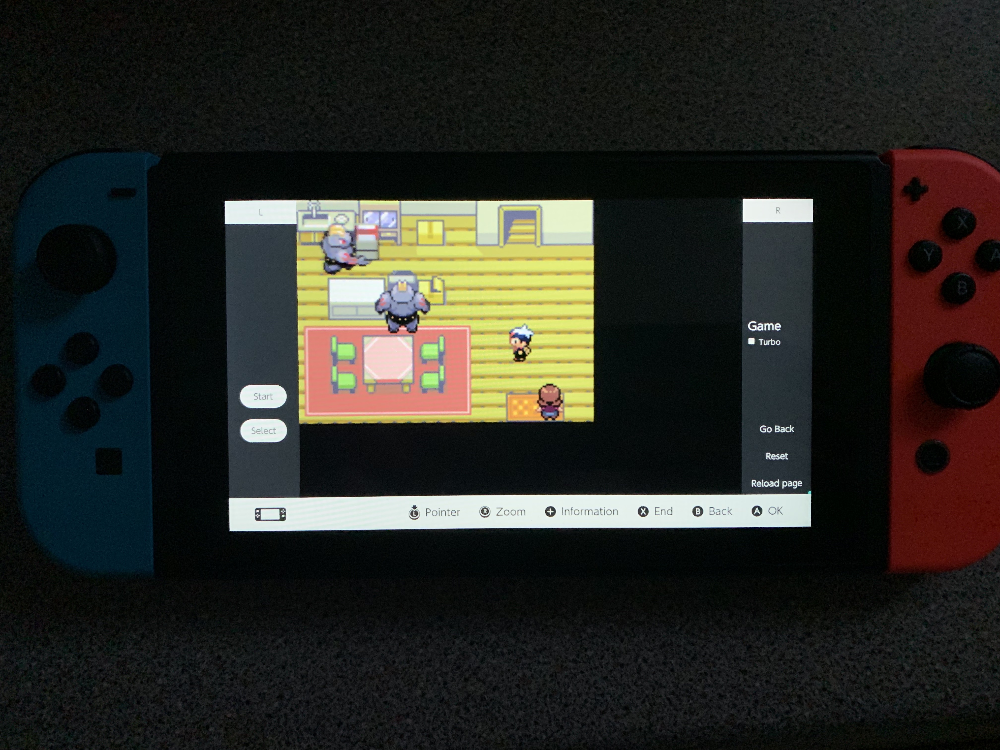
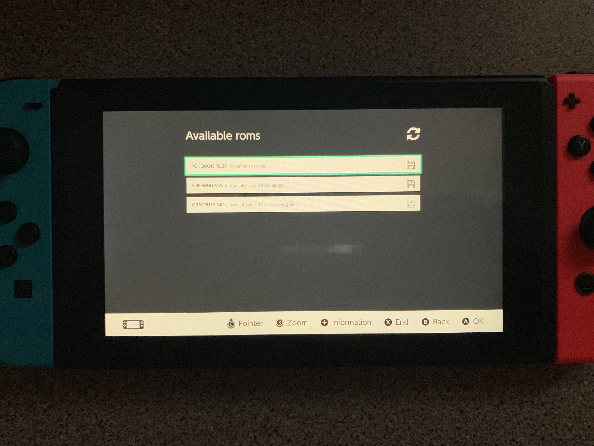

# Switch GBA Emulator





This project is meant as an experiment of what is possible and not to be used commercially.
This is a hobby project and therefore I won't commit to offering help / maintaining / updating this project unless I choose to do so.

This is a modified and heavily towards switch tailored version of [crowdsourced-gba](https://github.com/vinnyoodles/crowdsourced-gba) by vinnynoodles.

Switch supported HTML features http://html5test.com/s/a77ccd45f1540617.html

---
## Planned features
* Save states

---
## How?
This project makes use of the Switch browser that comes up when trying to verify / sign in with certain DNS providers. I won't explain how to do this here but if are capable of setting this up you certainly will also be able to find that information yourself.

The browser is really, really limited. Only certain keys send actual events. Those are:
1. **The analog stick and dpad buttons**
Those were the easiest to work with. They essentially work all the time without any special configuration needed. Mostly important was setting `tabindex=-1` on all buttons so that you don't get a quite annoying / distracting button highlight flying around on the screen.

2. **The 'A' button**
Only sends an event if you're focused on an input element. The input element has to be visible! The way I dealt with it is that I added a 1px dummy button in the bottom right corner which I always reset the focus to automatically if anything else on the screen is pressed.

#### The problem
Literally every other button doesn't send an event (or only when in input mode).
I was fine with having `Start` / `Select` / `L` / `R` on screen however `B` was too important to map there. The issue is `B` in the browser set the current view to the last visited page (no call or button press, it happens in some upper layer that you can't access).

#### The fix
This is where the fun begins, the way the Switch handles `B` is a bit different if there is an iFrame present on the page. In this case `B` will actually navigate the iFrame back first **before** navigating back the actual page (or reloading it). This is crucial for my workaround. With the use of `postMessage` I always immediately return to a "navigated" state of the iFrame while using the navigation event as a button input. Sadly it isn't possible to maintain a `keydown` state, I worked around that by making a `B` press a `down` event by default which gets interrupted by any other keypress.

---
## Misc issues / features
Some other stuff that I build / had to deal with.

* `Page size too large, refresh the page`
This popped up every now and then and then made the window lag out continously even when `Cancel` is pressed. I changed from `png` to uncompressed `webp` images and added logic that disconnects the WebSocket if there's no input for more than 10 seconds. The WebSocket automatically reconnects if there's new input.

* `Turbo mode`
When enabled turbo mode makes the emulator tick at x9 of the normal speed (540 vs 60 fps). The output rate of frames remains 60 so the switch doesn't choke up.

* `Audio` Sadly the switch doesn't seem to have an exposed audio API for the web browser. I'm still looking for a solution since various feature checkers actually report a prefixed `AudioContext` to be present but I didn't have luck with that yet.

---
## Usage
I'm not distributing any roms, so you will have to make a folder `roms` with your `.gba` files directly in it.

To run the server just execute:
````
docker run --name switch-gba -d -p 80:8888 -v $(pwd)/roms:/home/roms -d bfriedrichs/switch-gba
````
Then just connect to it from the switch browser.

