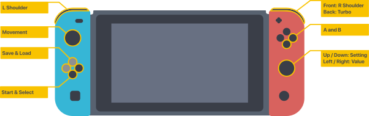

# Switch GBA Emulator


## Motivation
Homebrewing / Hacking a switch is too much of a dangerous affair for me personally and after learning there is a browser I tried to get it running in there. Turns out it is (sort of) possible.

<details>
  <summary>Preview (UI is changed now)</summary>
  
  <p float="left">
  
  
  </p>
</details>

This project is meant as an experiment of what is possible and not to be used commercially.
This is a hobby project and therefore I won't commit to offering help / maintaining / updating this project unless I choose to do so.

<details>
  <summary>Information / How it's done</summary>
  This project makes use of the Switch browser that comes up when trying to verify / sign in with certain DNS providers. I won't explain how to do this here but if are capable of setting this up you certainly will also be able to find that information yourself.

  The way the Switch handles `B` is a bit different if there is an iFrame present on the page. In this case `B` will actually navigate the iFrame back first **before** navigating back the actual page (or reloading it). This is crucial for my workaround. With the use of `postMessage` I always immediately return to a "navigated" state of the iFrame.

    This is a modified and heavily towards switch tailored version of [crowdsourced-gba](https://github.com/vinnyoodles/crowdsourced-gba) by vinnynoodles.
</details>

---
## Planned features
* [Done] Save states
* [Done] Gamepad API

---
## Button Layout
Thanks to the Gamepad API I was able to remove most of the onscreen buttons and enable hardware button support.



<details>
  <summary>In Text</summary>
  <ul>
    <li>A / B as usual</li>
    <li>Left stick for movement</li>
    <li>DPad right for start</li>
    <li>DPad down for select</li>
    <li>Front shoulder buttons for L / R</li>
    <li>Back right shoulder button for turbo mode while pressed</li>
    <li>Right stick up / down for selecting values</li>
    <li>Right stick left / right for selecting values</li>
    <li>Right stick press for save</li>
    <li>Right stick double press for load</li>
</details>

------
## Usage

The emulator in it's entirety is ready to be pulled as a docker image. It runs on and exposes port `8888` by default.

**Docker Images**
````
Latest release
bfriedrichs/switch-gba:release-latest

Latest master (possibly unstable)
bfriedrichs/switch-gba:latest

Latest dev (most likely unstable)
bfriedrichs/switch-gba:dev

Older release
bfriedrichs/switch-gba:release-{version}
````

I'm not distributing any roms, so you will have to make a folder `roms` with your `.gba` files directly in it.

---
## Versions

## 1.0.0
* Initial release
* ROM selection
* Gamepad support
* Turbo mode (2-20x speed)

---
## Misc issues / features
Some other stuff that I build / had to deal with.

* `Page size too large, refresh the page`
This popped up every now and then and then made the window lag out continously even when `Cancel` is pressed. I changed from `png` to uncompressed `webp` images and added logic that disconnects the WebSocket if there's no input for more than 10 seconds. The WebSocket automatically reconnects if there's new input.

* `Turbo mode`
When enabled turbo mode makes the emulator tick at times the speed of its usual execution (e.g. 600 vs 60 fps for x10). The output rate of frames remains 60 so the switch doesn't choke up.

* `Audio` Sadly the switch doesn't seem to have an exposed audio API for the web browser. I'm still looking for a solution since various feature checkers actually report a prefixed `AudioContext` to be present but I didn't have luck with that yet.

---
## Resources

Switch supported HTML features http://html5test.com/s/a77ccd45f1540617.html
